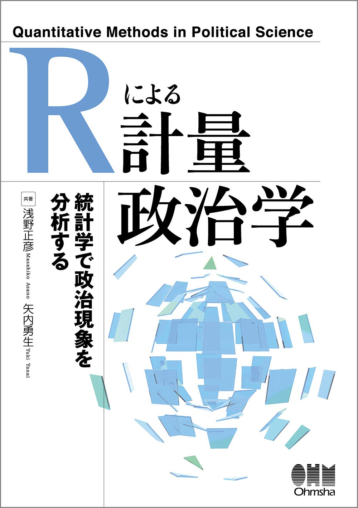

# quant-methods-R

# 『Rによる計量政治学』サポートページ

### [amazon.co.jpで購入](https://amazon.jp/dp/4274223132/) できます

- 著者
	- [浅野 正彦 (Masahiko ASANO)](https://www.asanoucla.com/), Ph.D.
	- [矢内 勇生 (Yuki YANAI)](http://www.yukiyanai.com), Ph.D.
- 出版社：[オーム社](https://www.ohmsha.co.jp/)
- 出版年月：2018年12月
- ISBN: 978-4274223132

 

<!-- START doctoc generated TOC please keep comment here to allow auto update -->
<!-- DON'T EDIT THIS SECTION, INSTEAD RE-RUN doctoc TO UPDATE -->

- [目次](#%E7%9B%AE%E6%AC%A1)
  - [第I部 リサーチデザイン](#%E7%AC%ACi%E9%83%A8-%E3%83%AA%E3%82%B5%E3%83%BC%E3%83%81%E3%83%87%E3%82%B6%E3%82%A4%E3%83%B3)
  - [第II部 Rを使った計量分析の方法](#%E7%AC%ACii%E9%83%A8-r%E3%82%92%E4%BD%BF%E3%81%A3%E3%81%9F%E8%A8%88%E9%87%8F%E5%88%86%E6%9E%90%E3%81%AE%E6%96%B9%E6%B3%95)
- [本書で使用するデータ](#%E6%9C%AC%E6%9B%B8%E3%81%A7%E4%BD%BF%E7%94%A8%E3%81%99%E3%82%8B%E3%83%87%E3%83%BC%E3%82%BF)
- [正誤表](#%E6%AD%A3%E8%AA%A4%E8%A1%A8)
- [練習問題の解答](#%E7%B7%B4%E7%BF%92%E5%95%8F%E9%A1%8C%E3%81%AE%E8%A7%A3%E7%AD%94)
- [関連書籍](#%E9%96%A2%E9%80%A3%E6%9B%B8%E7%B1%8D)

<!-- END doctoc generated TOC please keep comment here to allow auto update -->

## 目次

### 第I部 リサーチデザイン

- 第 1章　計量政治学とは
- 第 2章　研究テーマの選び方
- 第 3章　理論と仮説

### 第II部 Rを使った計量分析の方法

- 第 4章　Rの使い方（Rスクリプト：[ch04.R](chapters-Rscripts/ch04.R)）
- 第 5章　Rによるデータ操作（[ch05.R](chapters-Rscripts/ch05.R)）
- 第 6章　記述統計とデータの可視化・視覚化（[ch06.R](chapters-Rscripts/ch06.R)）
- 第 7章　統計的推定（[ch07.R](chapters-Rscripts/ch07.R)）
- 第 8章　統計的検定（[ch08.R](chapters-Rscripts/ch08.R)）
- 第 9章　変数間の関連性（[ch09.R](chapters-Rscripts/ch09.R)）
- 第10章　回帰分析の基礎（[ch10.R](chapters-Rscripts/ch10.R)）
- 第11章　回帰分析による統計的推定（[ch11.R](chapters-Rscripts/ch11.R)）
- 第12章　回帰分析の前提と妥当性の診断（[ch12.R](chapters-Rscripts/ch12.R)）
- 第13章　回帰分析の応用（[ch13.R](chapters-Rscripts/ch13.R)）
- 第14章　交差項の使い方（[ch14.R](chapters-Rscripts/ch14.R)）
- 第15章　ロジスティック回帰分析（[ch15.R](chapters-Rscripts/ch15.R)）

## 本書で使用するデータ

**データの文字コードはすべてUTF-8です**。

- 衆議院議員総選挙小選挙区候補者データ, 1996-2017
	- 元のCSVファイル：[hr96-17.csv](data/hr96-17.csv)
	- 第5章で手を加えたもの：[hr96-17.Rds](data/hr96-17.Rds)
	- 第6章でさらに手を加えたもの：[hr-data.Rds](data/hr-data.Rds)（CSV版：[hr-data.csv](data/hr-data.csv)）

- 政党名の日本語表記と英語（ローマ字）表記の対応表：[parties.csv](data/parties.csv)

- 2010年のビールの売り上げと気温のデータ：[beer.csv](data/beer.csv)
	- 出所 (1) [総務省統計局](http://www.stat.go.jp/info/link/getujidb.html)
	- 出所 (2) [アサヒビール社](http://www.asahibeer.co.jp/ir/monthlydata/index.html)

- 身長の架空データ：[height.csv](data/height.csv)
- 横長 (wide) データ：[wide-table.csv](data/wide-table.csv)
<!--- 選挙結果の架空データ([logistic.csv]()) -->

- 第5章の練習問題用データ
	- [ex-ch05a.csv](data/ex-ch05a.csv)
	- [ex-ch05b.csv](data/ex-ch05a.csv)
	- [ex-ch05c.csv](data/ex-ch05a.csv)
	- [ex-ch05d.csv](data/ex-ch05a.csv)

## 正誤表

**tibble**パッケージ（`library("tidyverse")` で読み込まれる）で tibble（データフレーム）を作る関数が、`data_frame()` から `tibble()` に変更になったので、ご注意ください。

| ページ | 場所 | 誤 | 正 | 解説 |Credit |
| --- | ---| --- | --- |  --- | --- |
|81  | 下から3行目 | `tibble::data_frame()` | `tibble::tibble()` | `data_frame()` が `tibble()` に置き換えられたため。| |
|82  | 1つ目、2つ目、3つ目のRコード内 | `data_frame()` | `tibble()`  | 同上 | | 
|188 | Rコード内                   | `data_frame()` | `tibble()`  | 同上 | | 
|190 | 下から2つ目のRコード内        | `data_frame()` | `tibble()`  | 同上 | | 
|192 | 一番下のRコード内            | `data_frame()` | `tibble()`   | 同上 | | 
|249 | Rコード内                   | `data_frame()` | `tibble()`   | 同上 | | 
|251 | 最初のRコード内              | `data_frame()` | `tibble()`   | 同上 | | 
|309 | 最初のRコード内              | `data_frame()` | `tibble()`   | 同上 | | 
|310 | 2番目のRコード内             | `data_frame()` | `tibble()`   | 同上 | | 
|314 | 下から2つ目のRコード内        | `data_frame()` | `tibble()`   | 同上 | | 
|317 | 最初と2つ目のRコード内        | `data_frame()` | `tibble()`   | 同上 | | 
|323 | ページ下部のRコード内         | `data_frame()` | `tibble()`   | 同上 | | 
|320 | 最初と2つ目のRコード内 | `as_data_frame()` | `as_tibble()` | `as_data_frame()` が `as_tibble()` に置き換えられたため。 | | 
|326--327 | Rコード内（4箇所）| `as_data_frame()` | `as_tibble()`| 同上 | |
| 172 | 2つ目のRコード | `hr09 <-` から始まるコード全体（3行分）| `hr09 <- mutate(hr09, inc = fct_drop(status))` | 元のコードも誤りではないが、こちらの方が簡単。| [宋ジェヒョン](http://www.jaysong.net/)さん |
| 248 | 12.2.1 の5行目 | 誤差の分散均一性（前提3）と誤差の独立性（前提4） | 誤差の分散均一性（前提4）と誤差の独立性（前提3） | | [宋ジェヒョン](http://www.jaysong.net/)さん |

## 練習問題の解答

- 第 1章：練習問題なし
- 第 2章：[解答例](http://yukiyanai.github.io/jp/quant-methods-R/ch02-answers.html)
- 第 3章：[解答例](http://yukiyanai.github.io/jp/quant-methods-R/ch03-answers.html)
- 第 4章：解答例なし（本文中に解説あり）
- 第 5章：[解答例](http://yukiyanai.github.io/jp/quant-methods-R/ch05-answers.html)（Rmdファイル： [ch05-answers.Rmd](exercises/ch05-answers.Rmd)）
- 第 6章：[解答例](http://yukiyanai.github.io/jp/quant-methods-R/ch06-answers.html)（Rmdファイル： [ch06-answers.Rmd](exercises/ch06-answers.Rmd)）
- 第 7章：[解答例](http://yukiyanai.github.io/jp/quant-methods-R/ch07-answers.html)（Rmdファイル： [ch07-answers.Rmd](exercises/ch07-answers.Rmd)）
- 第 8章：[解答例](http://yukiyanai.github.io/jp/quant-methods-R/ch08-answers.html)（解答にRコード不要）
- 第 9章：[解答例](http://yukiyanai.github.io/jp/quant-methods-R/ch09-answers.html)（Rmdファイル： [ch09-answers.Rmd](exercises/ch09-answers.Rmd)）
- 第10章：[解答例](http://yukiyanai.github.io/jp/quant-methods-R/ch10-answers.html)（Rmdファイル： [ch10-answers.Rmd](exercises/ch10-answers.Rmd)）
- 第11章：[解答例](http://yukiyanai.github.io/jp/quant-methods-R/ch11-answers.html)（Rmdファイル： [ch11-answers.Rmd](exercises/ch11-answers.Rmd)）
- 第12章：[解答例](http://yukiyanai.github.io/jp/quant-methods-R/ch12-answers.html)（Rmdファイル： [ch12-answers.Rmd](exercises/ch12-answers.Rmd)）
- 第13章：[解答例](http://yukiyanai.github.io/jp/quant-methods-R/ch13-answers.html)（Rmdファイル： [ch13-answers.Rmd](exercises/ch13-answers.Rmd)）
- 第14章：[解答例](http://yukiyanai.github.io/jp/quant-methods-R/ch14-answers.html)（Rmdファイル： [ch14-answers.Rmd](exercises/ch14-answers.Rmd)）
- 第15章：[解答例](http://yukiyanai.github.io/jp/quant-methods-R/ch15-answers.html)（Rmdファイル： [ch15-answers.Rmd](exercises/ch15-answers.Rmd)）
- 解答例のRmdで使っているCSSファイル：[my-markdown.css](exercises/my-markdown.css)

## 関連書籍

- 浅野正彦, 中村公亮. 2018.『[はじめてのRStudio](https://www.ohmsha.co.jp/book/9784274222931/)』オーム社.
- 浅野正彦, 矢内勇生. 2013.『[Stataによる計量政治学](http://yukiyanai.github.io/jp/quant-methods-stata/)』オーム社.

